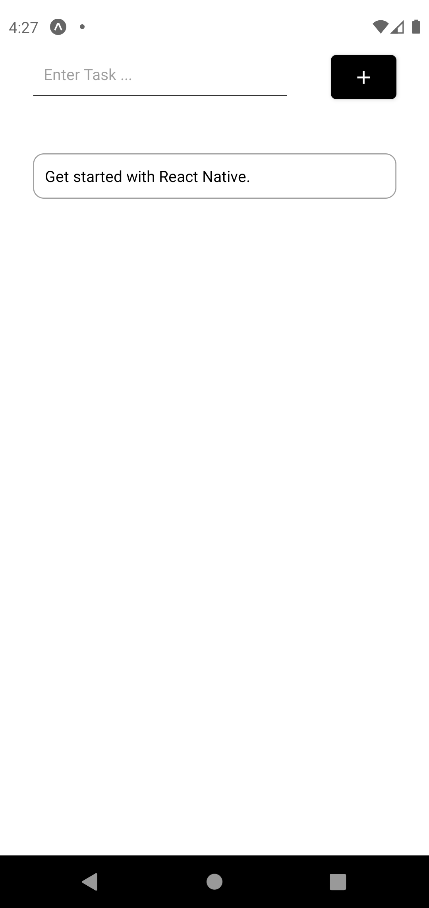
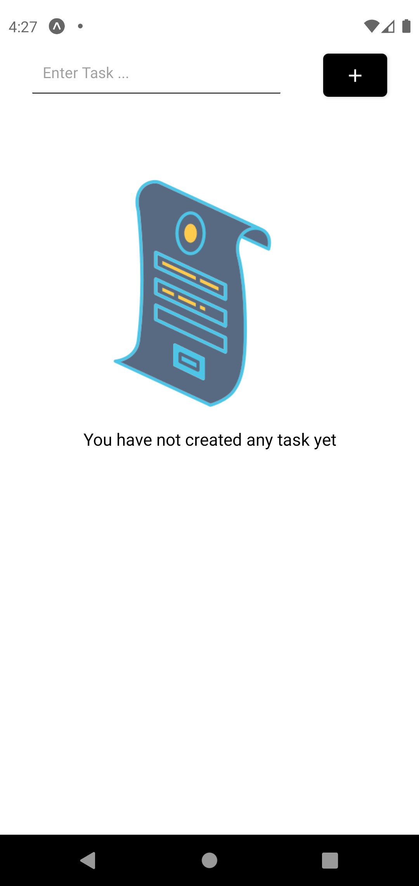

## NativeTodo

A simple Todo app build to get started with React Native.

### pic/screenshots





This is a [React Native](https://reactnative.dev/) project bootstrapped with [`expo init my-app`](https://docs.expo.io/get-started/create-a-new-app/).

## Getting Started

First, run the development server:

```bash
expo start
```

Open [http://localhost:19002/](http://localhost:19002/) with your browser to see the result.

## Learn More

To learn more about React Native, take a look at the following resources:

- [React Native Documentation](https://reactnative.dev/docs/) - learn about React Native features and API.
- [Learn expo](https://expo.io) - an interactive tool to build react native app.

### enjoy this one 👋🏼👋🏼
